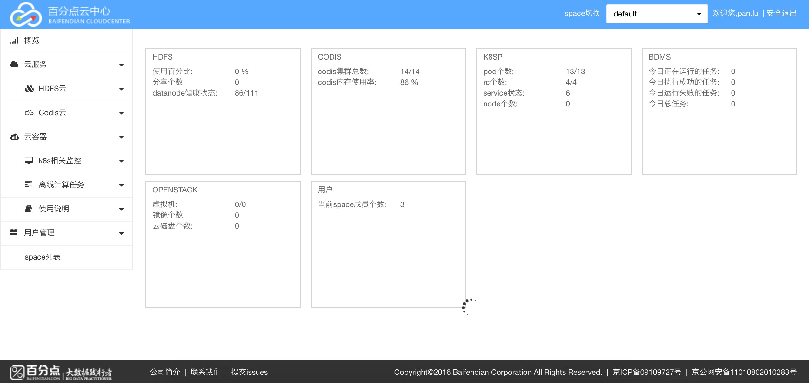
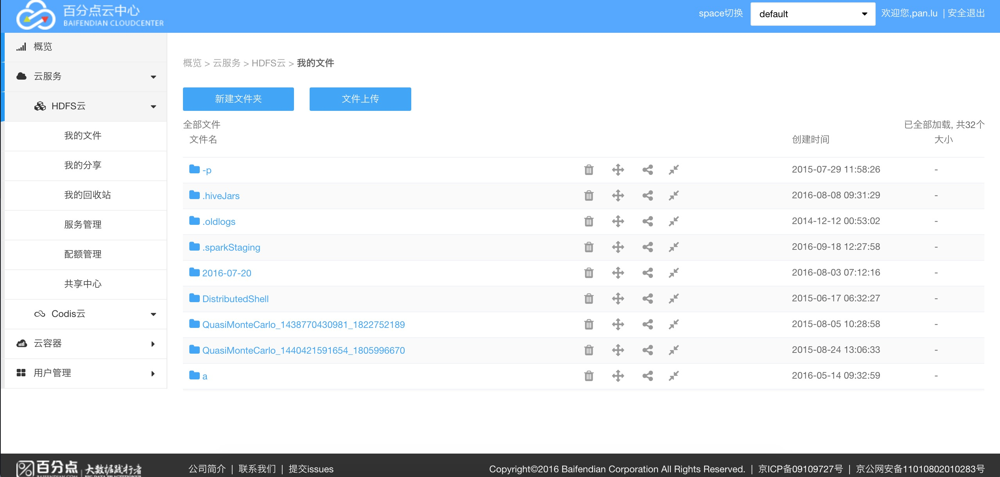
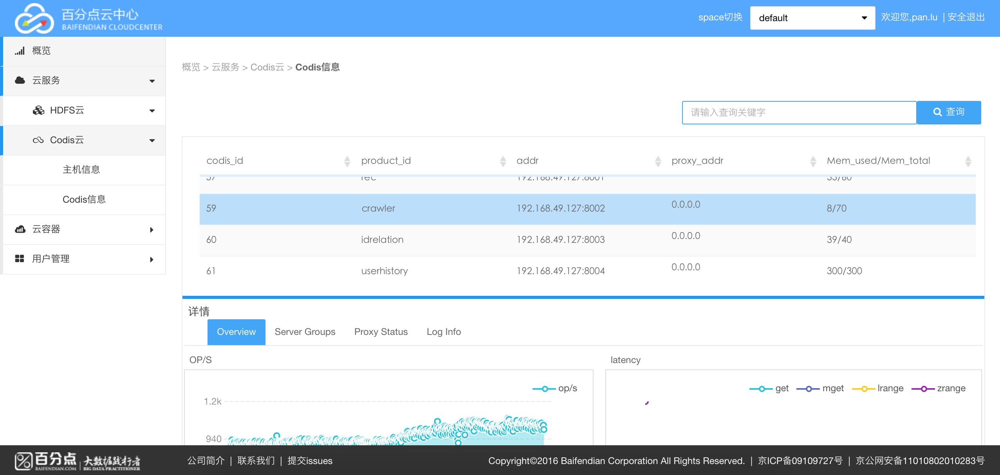
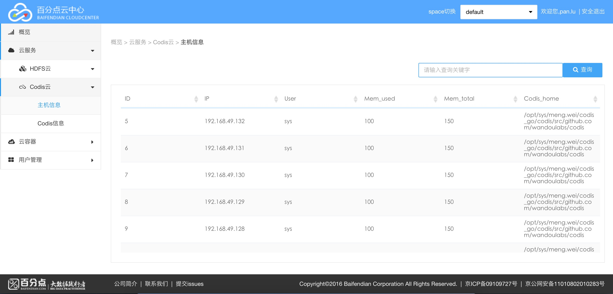
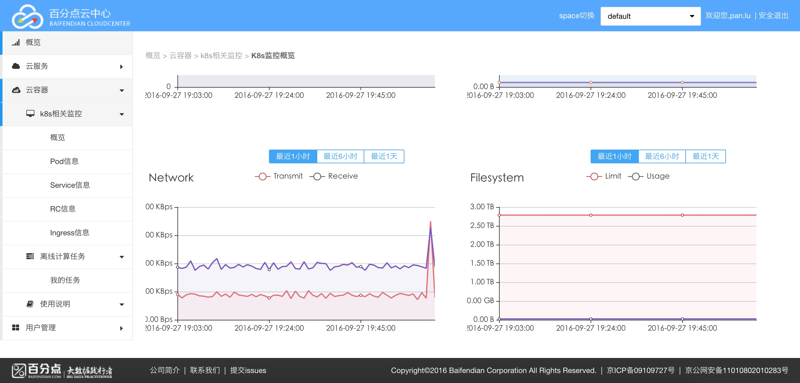
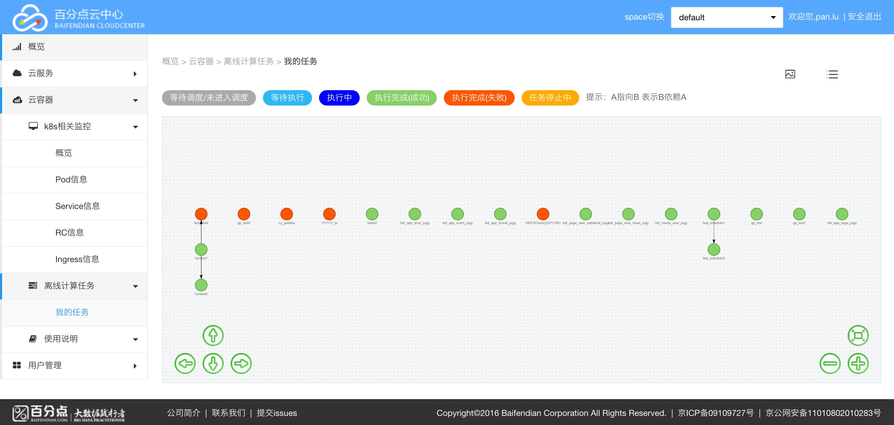
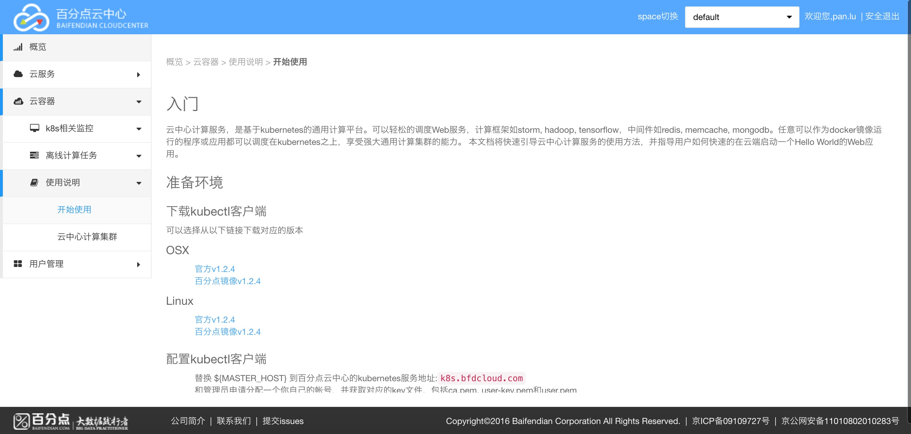
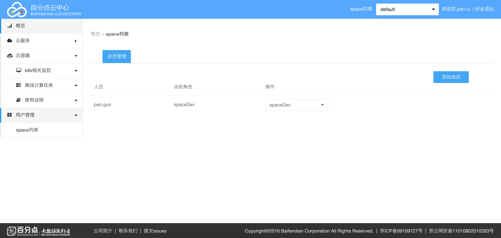

# <div id="1">Sirius是什么</div>

Sirius是由[百分点科技](www.baifendian.com)开发的一套云中心服务管理dashboard。

QQ讨论群：378093490
<a target="_blank"
 href="http://jq.qq.com/?_wv=1027&k=2GWFH6Q">
 
</a>

## <div id="overview">概览</div>

目前支持已经管理的服务统计功能:


## <div id="cloudService">云服务</div>

目前包含HDFS云和CODIS云服务的管理

### <div id="hdfsCloud">HDFS云</div>

目前支持HDFS文件系统的增加, 删除, 恢复, 分享, 上传, 下载, 统计等功能:


### <div id="codisCloud">COIDS云</div>

目前支持codis信息, 主机信息:

codis信息


主机信息


## <div id="cloudContainer">云容器</div>

### <div id="k8sMonitor">k8s相关监控</div>



### <div id="bdmsTask">离线计算任务</div>



### <div id="k8sDesc">k8s使用说明</div>



## <div id="userAuth">用户管理</div>
支持对用户的增加, 删除功能:


# <div id="deploy">如何部署</div>

* <a href="#commonDeploy">普通环境部署</a>
* <a href="#k8sDeploy">k8s集群的部署</a>

## <div id="#commonDeploy">普通环境部署</div>

(1) 代码拷贝

```bash
git clone https://github.com/baifendian/Sirius.git
```

(2) 创建Sirius隔离环境: virtualenv

```bash
[root@bjlg-24p100-40-xtjc06 opt]# pip install virtualenv   #安装 virtualenv 环境
[root@bjlg-24p100-40-xtjc06 opt]# virtualenv  sirius-pyenv --no-site-packages  #创建属于sirius的独立python环境
[root@bjlg-24p100-40-xtjc06 sirius-pyenv]# source bin/activate # 激活环境
```

(3) 安装Sirius python依赖包

```bash
pip install -r requirements.txt
```

(4) 配置Sirius

  修改 Aries.yaml文件

```yaml
SHARE_PROXY_BASE_URI: "http://172.24.3.64:10012"
REST_BASE_URI: "172.24.3.64:10012"

DATABASES:
  default:
    ENGINE: django.db.backends.mysql
    NAME: aries
    HOST: 172.24.3.64
    PORT: 3306
    USER: root
    PASSWORD: baifendian
  kd_agent_bdms:
    ENGINE: django.db.backends.mysql # Add 'postgresql_psycopg2', 'mysql', 'sqlite3' or 'oracle'.
    NAME: bdms_web10010        # Or path to database file if using sqlite3.
    USER: bdms                       # Not used with sqlite3.
    PASSWORD: bdms                  # Not used with sqlite3.
    HOST: 172.24.100.40             # Set to empty string for localhost. Not used with sqlite3.
    PORT: 3306                       # Set to empty string for default. Not used with sqlite3.

AUTH_LDAP:
  SERVER_URI: 'ldap://192.168.49.241:389'
  USER_DN_TEMPLATE: 'uid=%(user)s,ou=mrbs,dc=baifendian,dc=com'
  BIND_AS_AUTHENTICATING_USER: True
  CACHE_GROUPS: True
  GROUP_CACHE_TIMEOUT: 3600
  USER_ATTR_MAP:
    username: "givenName"
    password: "password"

AMBARI:
  AMBARI_URL: "http://172.24.3.64:8080/api/v1/clusters/hlg_ambari/"
  HDFS_URL: "http://172.24.3.156:50070/webhdfs/v1/"
  HADOOP_CLIENT: "hlg3p64-lupan"
  AMBARI_USER: "admin"
  AMBARI_PASSWORD: "admin"


K8S:
  K8S_IP: '172.24.3.150'
  K8S_PORT: 8080
  INFLUXDB_IP: 'k8sinfluxapi.bfdcloud.com'
  INFLUXDB_PORT: 80
  INFLUXDB_DATABASE: 'k8s'

BDMS:
  IP: '172.24.100.40'
  PORT: '10001'
  USERNAME: 'aiping.liang'
  PASSWORD: 'aiping.liang'


WEBHDFS:
  HOSTS:
    - 172.24.3.155:50070
    - 172.24.3.156:50070
  PORT: 50070
  PATH: "/webhdfs/v1"
  USER: "hadoop"
  TIMEOUT: 10
  MAX_TRIES: 2
  RETRY_DELAY: 3

CODIS:
  INDEX_LINE: 1
  ZK_ADDR: '172.24.3.64:2181'
  HOST_INFO:
    - 0
    - 172.24.3.64
    - root
    -
    - 0
    - a
    - 0
  MEMORY_MAX: 10
  PENTSDB_URL: "http://172.24.4.33:4242"
  SSH_PKEY: '/root/.ssh/id_rsa'
  SSH_KNOWN_HOSTS: '/root/.ssh/known_hosts'

OPENSTACK:
  IP_KEYSTONE: "192.168.190.11"
  PORT_KEYSTONE: 5000
  IP_NOVA: "192.168.190.11"
  PORT_NOVA: 8774
  IP_CINDER:  "192.168.190.11"
  PORT_CINDER: 8776
```

(5) 启动Sirius

```
  sh sbin/Aries.sh start
```

(6) 停止Sirius

```bash
  sh sbin/Aries.sh stop
```

(7) 登录

```bash
127.0.0.1:10086
```


```bash
用户名, 密码为ldap的用户名和密码
```

## <div id="k8sDeploy">k8s集群的部署</div>

提示: 由于目前sirius的docker image放在 docker.baifendian.com 私服中.

(1) 代码拷贝并修改配置文件

```Bash
git clone https://github.com/baifendian/Sirius.git
```

(2) 下载kubectl客户端

* OSX: [官方v1.2.4](https://storage.googleapis.com/kubernetes-release/release/v1.2.4/bin/darwin/amd64/kubectl)
* Linux: [官方v.1.2.4](https://storage.googleapis.com/kubernetes-release/release/v1.2.4/bin/linux/amd64/kubectl)

(3) 配置kubectl客户端

```Bash
$ kubectl config set-cluster default-cluster --server=https://${MASTER_HOST} --certificate-authority=${CA_CERT}
$ kubectl config set-credentials default-admin --certificate-authority=${CA_CERT} --client-key=${ADMIN_KEY} --client-certificate=${ADMIN_CERT}
$ kubectl config set-context default-system --cluster=default-cluster --user=default-admin --namespace=${NAMESPACE}
$ kubectl config use-context default-system
```

(4) 部署sirius在k8s集群中

```Bash
$ cd $SIRIUS_HOME/docker-k8s/k8s_config  #进入k8s配置文件目录
$ kubectl create -f sirius-svc.yaml
$ kubectl create -f sirius-rc.yaml
$ kubectl create -f sirius-ingress.yaml
```

(5) 登录

```bash
sirius.bfdcloud.com
```


```bash
用户名, 密码为ldap的用户名和密码
```
