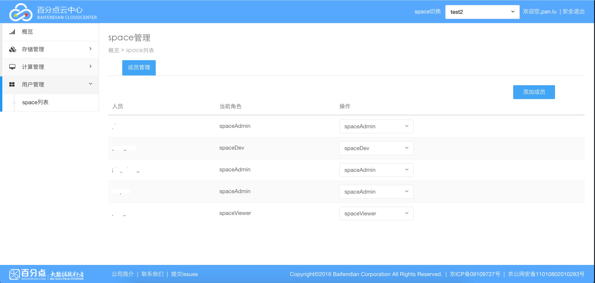
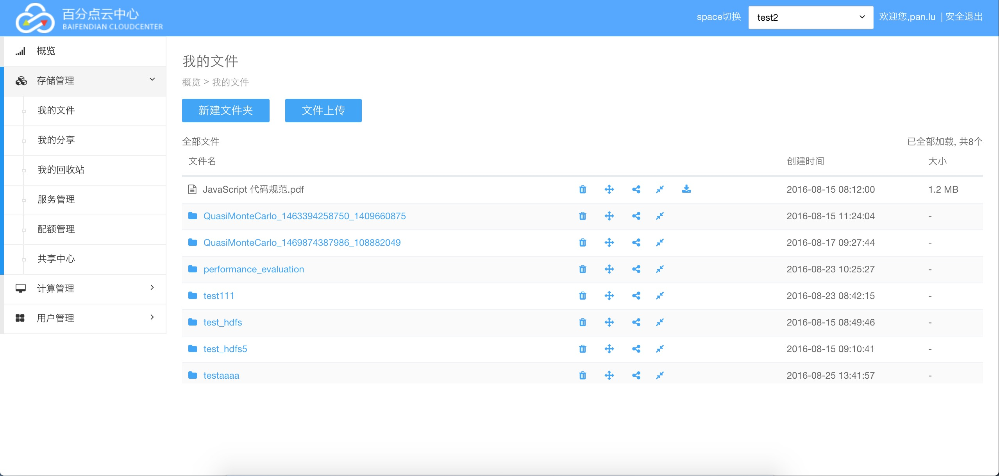

# Table of Contents

* <a href="#1">Sirius是什么</a>
* <a href="#2">功能介绍</a>
* <a href="#3">如何部署</a>

## <div id="1">Sirius是什么</div>
Sirius是由[百分点科技](www.baifendian.com)开发的一套云中心服务管理dashboard。
## <div id="2">功能介绍</div>
目前已经包含:
* <a href="#4">用户管理</a>
* <a href="5">HDFS管理</a>
* <a href="6">计算管理</a>
* ......
### <div id="4">用户管理</div>
支持对用户的增加, 删除功能:
<br/><br/>

### <div id="5">HDFS管理</div>
支持对HDFS文件系统的增加, 删除, 恢复, 分享, 上传, 下载, 统计等功能:
<br/><br/>

### <div id="6">计算管理</div>
支持对集群的管理:
<br/><br/>

## <div id="3">如何部署</div>
(1) 代码拷贝
```bash
git clone https://github.com/baifendian/Sirius.git
```
(2) 创建Sirius隔离环境: virtualenv
```bash
[root@bjlg-24p100-40-xtjc06 opt]# pip install virtualenv   #安装 virtualenv 环境
[root@bjlg-24p100-40-xtjc06 opt]# virtualenv  sirius-pyenv --no-site-packages  #创建属于sirius的独立python环境
[root@bjlg-24p100-40-xtjc06 sirius-pyenv]# source bin/activate # 激活环境
```
(3) 安装Sirius python依赖包
```bash
pip install -r requirements.txt
```
(4) 配置Sirius<br/>
    修改 Aries.xml配置文件
    ```
      <pythonpath>/xxxx/Sirius/Aries</pythonpath>
    ```
    修改 settings.py配置文件
    ```python
      AUTH_LDAP_SERVER_URI = 'ldap://{ip}:{port}'
      REST_BASE_URI="{ip}:10086"
      SHARE_PROXY_BASE_URI="http://${ip}:10086"
      AMBARI_URL="http://172.24.3.64:8080/api/v1/clusters/hlg_ambari/"
      HADOOP_CLIENT="bjlg-24p1001-40-xtjc06.bfdabc.com"
      AMBARI_USER="admin"
      AMBARI_PASSWORD="admin"
      LOG_BASE_DIR="/opt/pan.lu/gitsource/Sirius-patch/Sirius/log"
      #数据库部分修改
      DATABASES = {
          'default': {
              'ENGINE': 'django.db.backends.mysql',
              'NAME': 'aries',
              'HOST':'172.24.100.40',
              'PORT':'3306',
              'USER':'root',
              'PASSWORD':'Xaf8K0ws'
          },
          # used by app : kd_agent
          'kd_agent_bdms': {
              'ENGINE': 'django.db.backends.mysql', # Add 'postgresql_psycopg2', 'mysql', 'sqlite3' or 'oracle'.
              'NAME': 'bdms_web',                   # Or path to database file if using sqlite3.
              'USER': 'bdms',                       # Not used with sqlite3.
              'PASSWORD': 'bdms',                   # Not used with sqlite3.
              'HOST': '172.24.2.114',             # Set to empty string for localhost. Not used with sqlite3.
              'PORT': '3306',                       # Set to empty string for default. Not used with sqlite3.
          }
      }
      #namenode ha 地址修改
      WEBHDFS_HOSTS = [
          "127.0.0.1:50070",
          "127.0.0.2:50070",
      ]
      # webhdfs port, it`s default value is 50070
      #修改hadoop-run.sh脚本地址
      HADOOP_RUN_SCRIPT = "hadoop-run.sh"
      #K8S部分修改
      K8S_IP = '172.24.3.x'
      K8S_PORT = 8080
```
(5) 启动Sirius
```bash
  sh sbin/Aries.sh start
```
(6) 停止Sirius
```
  sh sbin/Aries.sh stop
```
(7) 登录
```
127.0.0.1:10086
```

```
用户名, 密码为ldap的用户名和密码
```
